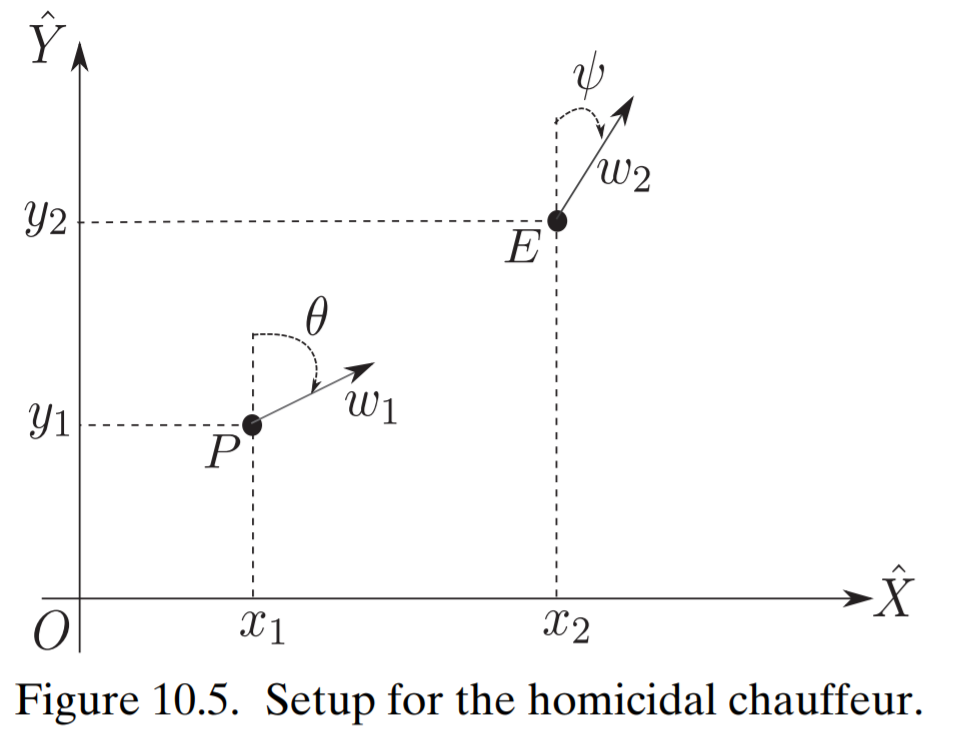
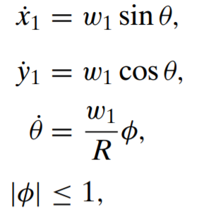
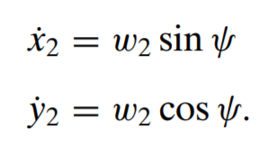

# Differential Games

Simulating differential games (specifically pursuit/evasion scenarios) using python.  

### Homicidal Chauffeur Problem - 2 Body Pursuit/Evasion
**Differential equations**

 

source: _[Fundamentals of Aerospace Navigation and Guidance](https://www.cambridge.org/core/books/fundamentals-of-aerospace-navigation-and-guidance/introduction-to-differential-games/60EE260EF7F997C3A7E1E97C6FCD8BB1)_ by Kabamba & Girard

**Differential equation solver**  
[Python/Scipy _solv_ivp_](https://docs.scipy.org/doc/scipy/reference/generated/scipy.integrate.solve_ivp.html#scipy.integrate.solve_ivp)
or could implement as a discrete time system...

**Player strategy ideas** (for choosing heading angles)

- Minimize/maximize distance
- Move in tangential direction of attacker
- Knowing previous history of other player or not
- Neural network / machine learning for creating strategy using sklearn libraries (maybe...)

**Pursuer strategies**

- `phiSingleState` - calculates the required `phi` to reach the evader using a single snapshot (issues with `arctan2` range wrap)
- `phiThetaHistory` - calculates the required `phi` to reach the evader using previous `theta` history (solves the `arctan2` wrap issue)
- `phiPerturb` - simple method based on `phiThetaHistory` but handles a detected loop by perturbing the pursuer `phi`

**Evader strategies**

- `psiRandom` - random direction changes every 20 steps
- `psiTurn90` - every 5 steps, calculates new `psi` that is 90 degrees from a line drawn from pursuer to evader. Left vs right turn is handled depending on pursuer heading.

**Current winning strategy:** `phiPerturb` beats all pursuer methods  
_Caveat: this may be because of a flaw in the `psiTurn90` algorithm_

**Algorithms**

1. Initialize with some set of parameters.
2. Simulate first step using ODE solver.
3. Choose heading angles using strategy.
4. Repeat 2 and 3 until time runs our or collision occurs.

**Notes**

- wavy behavior exhibited when using `phiCalcSingleState` is solved using `np.unwrap` with previous history in `phiCalcThetaHistory`
  - not sure if this is a bug or not: whenever the pursuer misses, it makes a loop.
- Running instructions (overall run with `python3 main.py`):
  - `runAllSim` runs all methods against each other and outputs results
  - `runSim` runs a specific method
  - `animate.animate` allows for animated python figure
- To-Do: rewrite using object oriented programming
