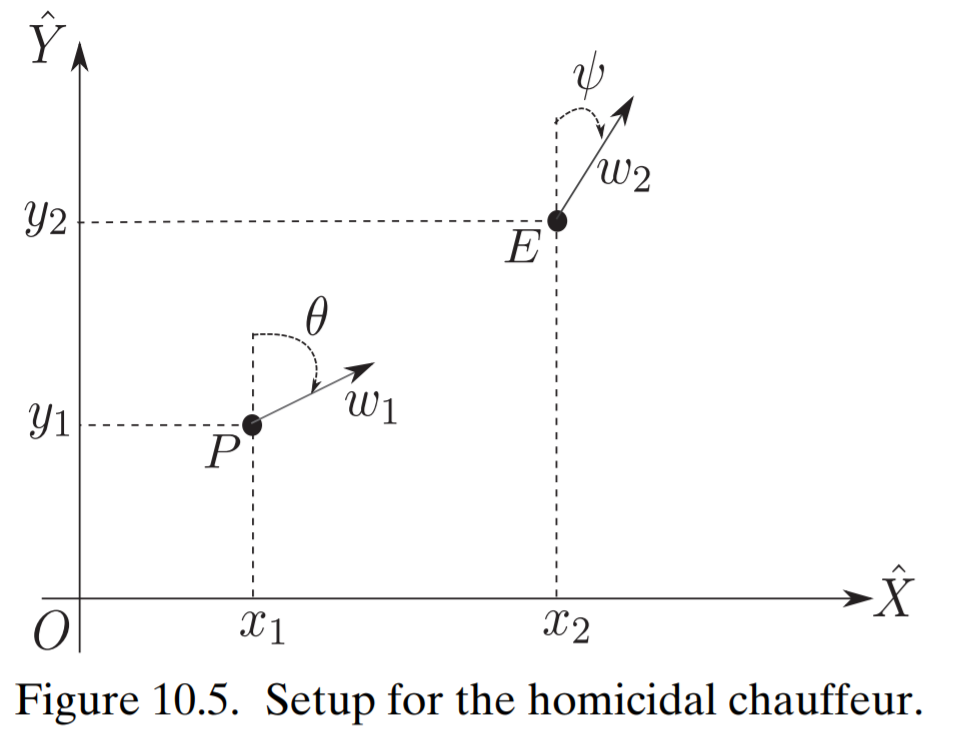
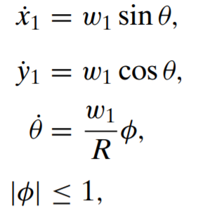
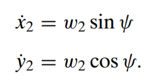

# Differential Games

Simulating differential games (specifically pursuit/evasion scenarios) using python.

### Homicidal Chauffeur Problem - 2 Body Pursuit/Evasion

Differential equations:

 

source: _[Fundamentals of Aerospace Navigation and Guidance](https://www.cambridge.org/core/books/fundamentals-of-aerospace-navigation-and-guidance/introduction-to-differential-games/60EE260EF7F997C3A7E1E97C6FCD8BB1)_ by Kabamba & Girard

Differential equation solver:  
[Python/Scipy _solv_ivp_](https://docs.scipy.org/doc/scipy/reference/generated/scipy.integrate.solve_ivp.html#scipy.integrate.solve_ivp)

Player strategies (for choosing heading angles):
- Minimize/maximize distance
- Move in tangential direction of attacker
- Neural network for choosing strategy (maybe...)

Algorithm:
1. Initialize with some set of parameters.
2. Simulate first step using ODE solver.
3. Choose heading angles using strategy.
4. Repeat 2 and 3 until time runs our or collision occurs.
